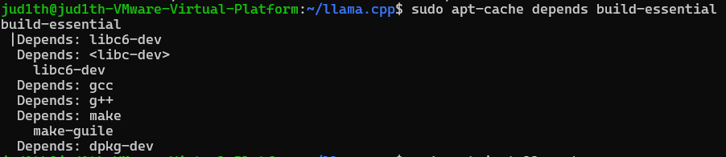
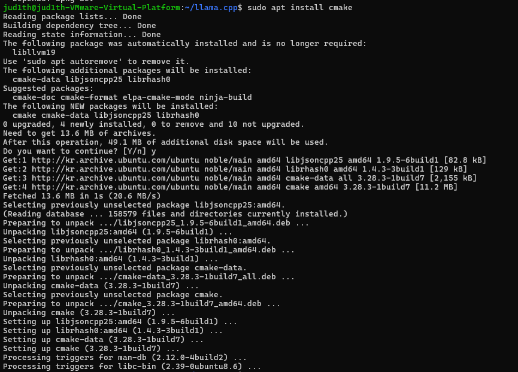
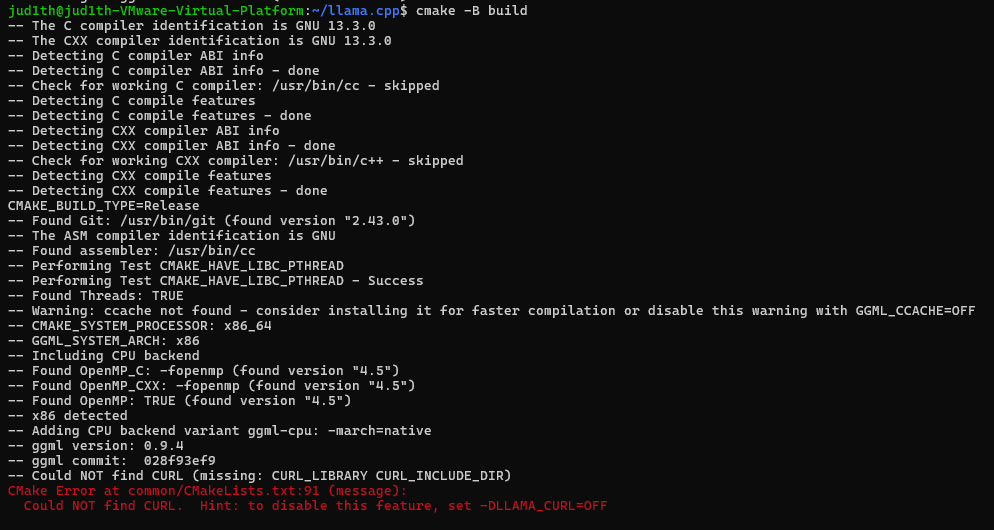
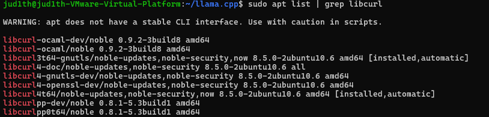
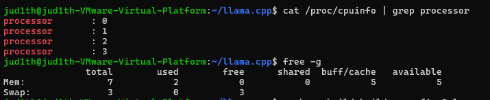

# Week03 

Ollama는 내부 동작이 추상화되어 있어, 스터디 목적인 모델 실행 구조를 딥다이브하기엔 한계가 있다고 판단하고 HuggingFace 기반 방식으로 전환하기로 결정했다.

---

## 1. HuggingFace 가입 및 SSH Key 등록

### 1-1. HuggingFace 계정 생성

- [https://huggingface.co](https://huggingface.co/) 접속
- Sign Up 진행 후 이메일 인증

### 1-2. SSH Key 생성

```bash
ssh-keygen -t ed25519 -C "your_email@example.com"
```

생성 후 공개키 확인:

```bash
cat ~/.ssh/id_ed25519.pub
```

### 1-3. HuggingFace에 SSH Key 등록

- HuggingFace도 Git 기반 서비스이기 때문에 GitHub에 SSH Key를 등록하는 과정과 매우 유사하다
    - https://github.com/{username}.keys 로 접근하면 공개 키들이 나열된다는 언급된다
- HuggingFace → Settings → SSH Keys
- 공개키 붙여넣기 후 Save 

<br>
<br>

## 2. Gemma3 GGUF 모델 클론
### 2-1. 필요 패키지: git-lfs
- Git LFS(Large File Storage)는 Git이 기본적으로 처리하기 어려운 대용량 파일을 효율적으로 관리하기 위한 확장 도구
- Git에는 실제 파일 대신 "포인터 파일"만 저장, 실제 데이터는 LFS 전용 서버에서 별도로 관리
- 용량이 매우 큰 GGUF 모델을 정상적으로 내려받기 위해 필요

```bash
sudo apt install git-lfs git-xet
```
### 2-2. 필요 패키지: git-xet
- HuggingFace에서 사용하는 차세대 대용량 파일 관리 시스템으로, Git LFS보다 더 최적화된 방식으로 대규모 모델 파일을 처리하기 위해 도입된 도구
- 아직 [Migrating the Hub from Git LFS to Xet](https://huggingface.co/blog/migrating-the-hub-to-xet?utm_source=chatgpt.com) 중이라서 git-lfs, xet 둘 다 설치해 줌

xet은 apt로 설치되지 않아, HuggingFace에서 제공하는 설치 스크립트를 통해 설치했다.

```bash
curl --proto '=https' --tlsv1.2 -sSf https://raw.githubusercontent.com/huggingface/xet-core/refs/heads/main/git_xet/install.sh | sh
```
설치 확인:
```bash
git-xet --version
```
### 2-3. 모델 클론
https://huggingface.co/google/gemma-3-1b-it-qat-q4_0-gguf
```bash
git clone git@huggingface.co:google/gemma-3-1b-it-qat-gguf
```

<details> <summary> sudo, apt </summary>

### sudo란 
- **sudo는 유닉스 및 리눅스 환경에서 일반 사용자가 일시적으로 관리자(root) 권한을 빌려 명령을 실행할 수 있도록 해주는 도구**
- Super User Do의 약자이며, 최근에는 Substitute User Do라는 의미로도 사용
- /etc/sudoers 파일에 등록된 사용자만 sudo 명령을 사용할 수 있음

### apt란 
- **apt는 리눅스에서 프로그램을 체계적으로 설치하고 관리하기 위한 패키지 관리 도구**
- Advanced Package Tool의 약자
- 내부적으로 dpkg를 기반으로 동작하며, 사용자는 의존성 문제를 직접 처리하지 않아도 됨

</details>

<br>
<br>

## 3. llama.cpp (직접) 빌드

### 3-1. llama.cpp 소스 클론

```bash
git clone https://github.com/ggerganov/llama.cpp
cd llama.cpp

```

### 3-2. llama.cpp 빌드를 위해 CMake를 설치(와 약간의 트러블슈팅)

#### build-essential 의존성 확인

```bash
sudo apt-cache depends build-essential
```

- CMake 빌드를 위해 필수 컴파일 도구 묶음인 build-essential이 정상 구성되어 있는지 확인했다.


- gcc, g++, make, libc6-dev 등이 함께 설치되는 구조임을 확인했고, 컴파일 환경은 문제없는 상태였다.


#### CMake 설치

```bash
sudo apt install cmake
```

- llama.cpp를 직접 빌드하기 위해 CMake를 수동 설치했다.


- 설치 과정에서 더 이상 사용되지 않는 패키지(libllvm9)가 감지되었으며, apt가 자동으로 정리 대상으로 안내했다.(sudo apt autoremove로 사용되지 않는 패키지 삭제해도 됨)

#### CMake 빌드 설정 시 CURL 오류 발생

```bash
cmake -B build
```

- CMake 설정 단계에서 다음 오류가 발생했다: Could NOT find CURL (missing: CURL_LIBRARY CURL_INCLUDE_DIR)


- libcurl을 필요로 한다고 한다..


#### libcurl 패키지 상태 점검 

```
sudo apt list | grep libcurl
```

- 런타임용 libcurl만 있고, 개발용 libcurl이 없는 상태

#### libcurl-dev 설치
```
sudo apt install libcurl4-openssl-dev
```

### 3-3. 빌드 디렉토리 생성 및 컴파일

- cpu코어랑, 메모리 현황을 점검했는데 현재 나는 4코어 CPU 환경이므로 2 스레드만 사용 (-j2)했다
```bash
cmake -B build
cmake --build build --config Release -j2
```

### 3-4. 정상 빌드 확인

```bash
./build/bin/llama-cli -h
```